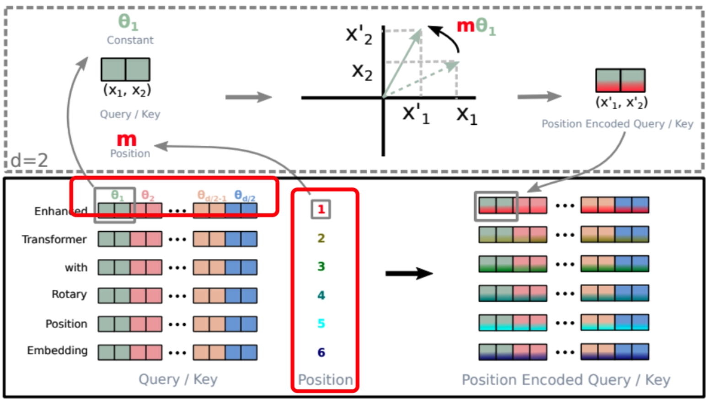

# 深入理解旋转位置编码 (RoPE)
---
## 项目链接：https://github.com/Tasselszcx/RoPE
---

## RoPE概述
旋转位置编码（Rotary Position Embedding, RoPE）是一种用于在Transformer模型中注入位置信息的先进技术。与传统的加性位置编码不同，RoPE通过一种创新的**旋转**操作，优雅地实现了相对位置编码，并已成为当今主流大语言模型（如 Llama, Qwen）的核心组件之一。

---

## 核心思想：RoPE的巧妙之处

RoPE设计的革命性在于它将位置信息以“乘性”的方式融入到词向量中，其核心优势体现在以下几点：

-   **优雅的相对位置编码**
    RoPE的核心是利用复数乘法的几何意义——旋转。它将token的绝对位置 `m` 映射为一个旋转角度，并将Query/Key向量在二维子空间中进行旋转。当计算位置 `m` 的Query和位置 `n` 的Key之间的注意力时，它们的交互自然地演变成一个只与相对位置 `m-n` 相关的旋转操作，从而以一种非常简洁的方式实现了相对位置编码。

-   **天然的远距离衰减**
    在RoPE的设计中，不同维度的特征会以不同的速度旋转。高维特征旋转得慢（低频），低维特征旋转得快（高频）。这带来了一个重要的隐式特性：随着两个token相对距离的增加，它们向量的内积（相似度）会呈现出衰减趋势。这符合自然语言中“距离越远，关联越弱”的直觉，有助于模型更好地捕捉局部依赖。

-   **保持向量模长**
    旋转是一种保范（isometry）操作，它只改变向量的方向而不改变其长度。这意味着在融入位置信息后，词向量本身承载的语义信息（在一定程度上由其模长体现）不会被破坏。这与直接相加的位置编码形成了鲜明对比，后者会改变向量的长度。

-   **与线性Attention的良好兼容性**
    RoPE直接作用于Query和Key，其数学形式可以与线性Attention（Linear Attention）等高效注意力机制无缝结合，使其在提升性能的同时，也能应用于需要更高计算效率的长序列场景。

---

## 数学原理与设计形式

### 二维简化理解

我们可以将一个二维向量 $(x_1, x_2)$ 视为一个复数 $x = x_1 + i x_2$。对于一个位于位置 $m$ 的token，我们构造一个代表其位置的单位复数 $e^{im\theta}$。

将位置信息融入词向量的操作，就是将两者相乘：

$$
x'_m = x \cdot e^{im\theta}
$$

这相当于将向量 $x$ 在复平面上旋转了 $m\theta$ 角度。

计算位置 `m` 的Query ($q$) 和位置 `n` 的Key ($k$) 之间的内积时，其编码后的形式为：

$$
\langle q'_m, k'_n \rangle = \text{Re}[ (q \cdot e^{im\theta}) \cdot \overline{(k \cdot e^{in\theta})} ] = \text{Re}[ (q \overline{k}) \cdot e^{i(m-n)\theta} ]
$$

这个结果非常优雅：内积的值只取决于**词的内容** ($q \overline{k}$) 和它们的**相对位置** ($m-n$)。

### 推广到高维向量

对于一个 $d$ 维的词向量，RoPE将其特征维度两两分组，每一组都视为一个二维向量（复数）进行旋转。为了实现远距离衰减，不同分组的旋转角速度 $\theta_i$ 是不同的：

$$
\theta_i = \text{base}^{-2i/d}, \quad i \in [0, 1, \dots, d/2 - 1]
$$

通常 `base` 取值为10000。维度越靠前（$i$ 越小），旋转速度越快。

对于一个 $d$ 维向量 $q_m$，其RoPE变换可以用一个块对角旋转矩阵 $R_m$ 来表示：

$$
q'_m = R_m q_m
$$

最终，Query和Key的内积可以表示为：

$$
(q'_m)^T k'_n = (R_m q_m)^T (R_n k_n) = q_m^T R_m^T R_n k_n = q_m^T R_{n-m} k_n
$$

内积计算再次只依赖于相对位置 $n-m$。

---

## 实现流程 (基于 `RoPE` 代码)

`RoPE` 的实现流程分为两大部分：**缓存生成**和**前向应用**。

### 缓存生成 (`get_cache`)

为了提高效率，旋转所需的 `cos` 和 `sin` 值会被预先计算并缓存。
1.  **计算频率 `theta`**：根据公式 $\theta_i = 1 / (\text{base}^{2i/d})$ 计算出一系列旋转频率。每个频率对应一对（两个）维度。
2.  **生成位置 `pos`**：创建一个从 `0` 到 `seq_len-1` 的位置索引序列。
3.  **计算角度 `angles`**：通过位置和频率的外积 `torch.outer(pos, theta)`，得到一个矩阵，其中每个元素是 `m * theta_i`，代表了特定位置 `m` 在特定频率 `theta_i` 下的旋转总角度。
4.  **生成缓存**：计算所有角度的 `cos` 和 `sin` 值，并将它们堆叠起来，形成一个形状为 `(seq_len, dim//2, 2)` 的缓存张量。

### 前向应用 (`forward`)

这是将RoPE实际应用到输入张量（Q或K）上的过程。
1.  **获取缓存**：检查并根据需要生成或获取缓存。
2.  **向量配对**：将输入张量 `x` 的最后一个维度 `dim` 重塑为 `(dim//2, 2)`。这一步在逻辑上将 `dim` 维向量变成了 `dim//2` 个二维向量，为后续的二维旋转做准备。
3.  **应用旋转**：从缓存中取出 `cos` 和 `sin` 值，并应用二维旋转矩阵的公式：
    -   `x_out_0 = x_0 * cos - x_1 * sin`
    -   `x_out_1 = x_0 * sin + x_1 * cos`
4.  **恢复形状**：将旋转后的 `dim//2` 个二维向量重新展平（`flatten`），恢复成 `dim` 维的原始形状。

---
